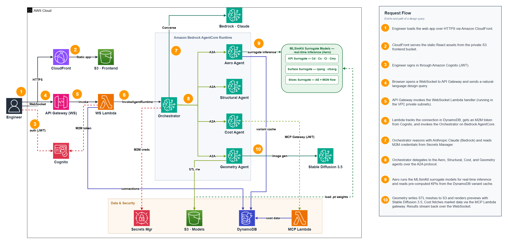

# Car Design Space Explorer

Multi-agent system for automotive aerodynamic design exploration, built with [Strands Agents SDK](https://strandsagents.com/) and deployed on [Amazon Bedrock AgentCore](https://docs.aws.amazon.com/bedrock-agentcore/).

Engineers interact via a chat interface to evaluate, modify, and compare car body designs using AI-powered aerodynamic prediction, structural analysis, cost estimation, and 3D geometry manipulation.

## Demo Instructions

For instructions on how to run the demo, including the live URL, login steps, and example prompts, see the **[Car Design Explorer Demo Guide](docs/Car-Design-Explorer-Demo-Guide.docx)**.

## Architecture



> Editable source: [`docs/architecture.drawio`](docs/architecture.drawio) (open with [draw.io](https://app.diagrams.net/) or the VS Code Draw.io extension).

### Agents

| Agent | Role | Key Dependencies |
|-------|------|-----------------|
| **Orchestrator** | Routes queries to specialists, chains multi-agent workflows | A2AClientToolProvider |
| **Aero** | Aerodynamic KPI prediction (Cd, Cs, Cl, Cmy), surface pressure/friction | MLSimKit, PyTorch, DynamoDB |
| **Structural** | Geometry metrics computation, structural feasibility | trimesh |
| **Cost** | Manufacturing cost estimation | MCP Gateway |
| **Geometry** | 3D mesh modification, Stable Diffusion previews, parametric STL generation | trimesh, Code Interpreter |

### Key Features

- **Pre-cached WindsorML variant KPIs** in DynamoDB for sub-100ms lookup
- **Live inference** on new/modified geometries
- **Parametric design** — specify ride height, diffuser angle, rear slant, etc.
- **3D viewer** — STL models load directly in the browser
- **Surface visualization** — pressure and friction heatmaps
- **Cost estimation** — automatic structural → cost agent chaining
- **Design modification** — add spoilers, mirrors, diffusers via natural language

### Security

- **Network isolation** — a dedicated VPC (2 public + 2 private subnets across 2 AZs, IGW + 2 NAT gateways); the WebSocket Lambda runs in the private subnets with egress via NAT.
- **Encryption at rest** — customer-managed KMS keys (rotation enabled) for DynamoDB, Secrets Manager, the Lambda dead-letter queue, and CloudWatch Logs; S3 buckets use SSE-S3 (AES256).
- **S3 hardening** — block-all-public-access, versioning, enforced TLS, and server access logging to a dedicated logging bucket.
- **Auth** — Cognito user pool (JWT) for the frontend and a separate M2M pool for agent-to-agent and MCP Gateway auth.

## Prerequisites

- AWS account (`us-east-1` recommended) with access to:
  - `us.anthropic.claude-haiku-4-5-20251001-v1:0` in the deployment region (all five agents)
  - `stability.sd3-5-large-v1:0` in `us-west-2` (Geometry image generation only)
- AWS CLI configured (`aws configure` or instance role)
- Python 3.10+
- Node.js 18+
- CDK v2: `npm install -g aws-cdk`
- Git LFS: `git lfs install`
- Deployment environment variables are listed once in the **Deployment** section below.

## Project Structure

```
car-design-explorer/
├── backend/
│   ├── agents/              # Strands agent implementations
│   │   ├── orchestrator_agent.py
│   │   ├── aero_agent.py
│   │   ├── structural_agent.py
│   │   ├── cost_agent.py
│   │   └── geometry_agent.py
│   ├── lambda_handler/      # WebSocket Lambda handler
│   ├── mcp_servers/         # MCP tool servers for cost agent
│   ├── training/            # ML inference and training code
│   └── models/weights/      # PyTorch model weights (Git LFS)
├── frontend/
│   ├── src/                 # React app (plain JS, CRA)
│   └── public/
│       └── config.json.example
├── infra/
│   ├── cdk/                 # CDK stacks (Cognito, API GW, Lambda, etc.)
│   └── seed/                # Data seeding scripts
├── deploy_agents.py         # Agent deployment script
└── deploy_mcp_lambda.py     # MCP Lambda deployment
```

## Deployment

Run from the `car-design-explorer/` directory after exporting the deployment settings once:

```bash
export FRONTEND_USERNAME_EMAIL="admin@example.com"
export FRONTEND_USERNAME_PASSWORD="YOUR_NEW_STRONG_PASSWORD"
export AGENT_MODEL_ID="us.anthropic.claude-haiku-4-5-20251001-v1:0"
export IMAGE_MODEL_ID="stability.sd3-5-large-v1:0"
export IMAGE_MODEL_REGION="us-west-2"
chmod +x deploy.sh
./deploy.sh
```

The password must be at least 8 characters and include lowercase, uppercase, and numeric characters. It is read from the environment and never displayed. The model variables are consumed by both CDK and the AgentCore deployment so their IAM permissions and runtime configuration stay aligned.

The script handles everything end-to-end:
- Installs Python and Node.js dependencies
- Pulls model weights via Git LFS
- Bootstraps and deploys all CDK stacks (VPC/NAT, Cognito, API Gateway, Lambda (in VPC), DynamoDB, CloudFront, S3, KMS)
- Provisions or updates the frontend Cognito user from the environment variables
- Deploys all 5 agents to Bedrock AgentCore Runtime (~20–30 min, parallel CodeBuild)
- Deploys the MCP Lambda for the Cost Agent
- Builds and deploys the React frontend

On completion, the password is intentionally not printed:

```
═══ Deployment Complete ═══
  Frontend URL     : https://<cloudfront-id>.cloudfront.net
  WebSocket        : wss://<api-id>.execute-api.us-east-1.amazonaws.com/prod
  Demo login email : admin@example.com
  Demo password    : configured from FRONTEND_USERNAME_PASSWORD (not displayed)
```

### Options

```bash
./deploy.sh --region us-west-2       # Deploy to a different region
./deploy.sh --skip-infra             # Re-deploy agents + frontend only
./deploy.sh --skip-agents            # Re-deploy infra + frontend only
./deploy.sh --frontend-only          # Rebuild and sync frontend only
```

---

## Redeploying a Single Agent

```bash
python3 deploy_agents.py --agent orchestrator \
  --cognito-user-pool-id ${USER_POOL_ID} \
  --cognito-client-id ${CLIENT_ID} \
  --agent-m2m-client-id ${AGENT_M2M_CLIENT_ID} \
  --mcp-user-pool-id ${MCP_USER_POOL_ID} \
  --region ${REGION}
```

Valid agent names: `orchestrator`, `aero`, `structural`, `cost`, `geometry`.

> The `--agent-m2m-client-id` and `--mcp-user-pool-id` flags are required so the
> redeployed agent's JWT authorizer accepts agent-to-agent (A2A) and MCP Gateway
> tokens. Omitting them can break inter-agent calls. The values are printed by
> `deploy.sh` (and stored in the `car-design/agent-oauth-credentials` secret).

## Wiring Lambda Manually

If the orchestrator ARN needs to be updated in the Lambda after a redeploy:

```bash
ORCHESTRATOR_ARN=$(python3 -c "import json; print(json.load(open('car_design_orchestrator_deployment.json'))['agent_arn'])")

python3 deploy_agents.py --wire-lambda \
  --orchestrator-arn ${ORCHESTRATOR_ARN} \
  --region ${REGION}
```

## Troubleshooting

| Symptom | Check |
|---------|-------|
| Agent stuck in `CREATING` | CloudWatch → CodeBuild log for that agent |
| `ORCHESTRATOR_RUNTIME_ARN` empty in Lambda | Run `--wire-lambda` step above |
| Cost agent returns no data | Verify `car-design/mcp-gateway-credentials` secret is populated |
| WebSocket connects but no response | Check `CarDesignWSHandler` Lambda CloudWatch logs |
| Frontend shows blank page | Verify `config.json` is deployed and CloudFront invalidation completed |
| `cdk deploy` fails on bootstrap | Run Step 2 bootstrap first |

## License

The source code in this repository is licensed under the [MIT No Attribution License](LICENSE), SPDX identifier `MIT-0`.

The trained model checkpoint files under `backend/models/weights/` are licensed under the [Creative Commons Attribution-ShareAlike 4.0 International License](backend/models/weights/LICENSE). See the [Model Card](MODEL_CARD.md) for WindsorML attribution, intended use, and model limitations.

Third-party components remain subject to their respective licenses. See [Third-Party Notices](THIRD_PARTY_NOTICES.md).
